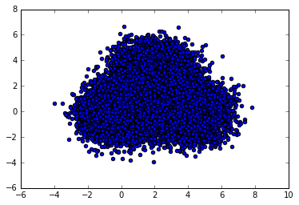
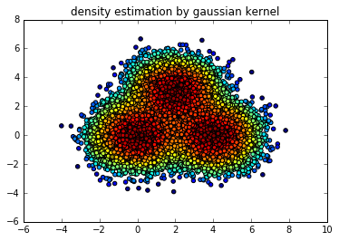
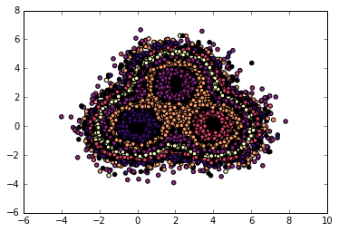
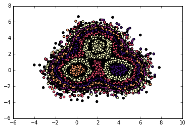
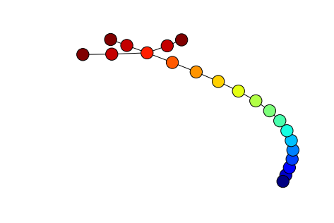

# データの構造をトポロジー的に解析する手法

## 初期化


```python
import numpy as np
import scipy as sp
import scipy.stats
import matplotlib.pyplot as plt
from sklearn.utils import shuffle
from scipy.cluster.hierarchy import *
from sklearn.neighbors.kde import KernelDensity
from numba.decorators import jit
import networkx as nx
%matplotlib inline
```

## サンプルデータの生成
実用時にはここを書き換える


```python
mean1 = np.array([0,0])
conv1 = np.array([[1,0],[0,1]])
mean2 = np.array([4,0])
conv2 = np.array([[1,0],[0,1]])
mean3 = np.array([2,3])
conv3 = np.array([[1,0],[0,1]])


M = 10000
x1 = np.random.multivariate_normal(mean1,conv1,(M))
x2 = np.random.multivariate_normal(mean2,conv2,(M))
x3 = np.random.multivariate_normal(mean3,conv3,(M))

xA =  np.concatenate([x1,x2,x3],0)

plt.scatter(xA[:,0],xA[:,1])
plt.show()
```





△生データではデータの配置がよくわからないことが分かる．正規分布が３つある．

## 密度推定


```python
kde = KernelDensity(kernel='gaussian', bandwidth=0.2).fit(xA)
d = kde.score_samples(xA)
```


```python
plt.scatter(xA[:,0],xA[:,1],c = d)
plt.title("density estimation by gaussian kernel")
plt.show()
```





## クラスタリング：単連結法と自作クラスタ数判定アルゴリズム


```python
def cluster(x):
    result1 = linkage(x, metric = 'euclidean', method = 'single')
    resN = result1.shape[0]
    K = 100 if resN > 100 else resN
    res = result1
    srs = res[:,2][-K:][::-1]
    srsl = np.log(srs)
    dsrd = srs[:-1]/srs[1:]
    tt = np.argwhere(dsrd > 1.3)
    if len(tt) == 0:
        cl_X = 1
    else:
        cl_X = tt[-1][0] +2 
    #print ("クラスタ数",cl_X)
    cl = fcluster(result1,cl_X,'maxclust')
    cl = cl -1
    return (cl,cl_X)
```

## クラスタリングを利用したトポロジー解析


```python
mi = np.min(d)
ma = np.max(d)
rg = ma-mi
D = 20
rgd = rg/D
p = 2/3
rgo = rgd / p
print (mi,ma)
```

    -8.92762198701 -2.92362469469
    


```python
N = xA.shape[0]
cl_list1 = np.empty(N,dtype = np.int)
cl_list2 = np.empty(N,dtype = np.int)
cl_list1[:] = 0
cl_list2[:] = 0
cl_list = [cl_list1,cl_list2]
cl_filist = [-1]

swapid = 0
cl_Xs = 1
for i in range(D):
    id = i
    mask = np.logical_and(mi+rgd*id<d, d<mi+rgd*id+rgo)
    (cl,cl_X) = cluster(xA[mask])
    cl_list[swapid][mask] = cl + cl_Xs
    for j in range(cl_X):
        cl_filist.append(i)
    
    swapid = 1 if swapid == 0 else 0
    cl_Xs += cl_X
cl_filist = np.array(cl_filist)
print(len(cl_filist))
```

    86
    


```python
plt.scatter(xA[:,0],xA[:,1],c=np.mod(cl_list1,5)+np.not_equal(cl_list1,0),cmap='magma')
plt.show()
plt.scatter(xA[:,0],xA[:,1],c=np.mod(cl_list2,5)+np.not_equal(cl_list2,0),cmap='magma')
plt.show()
```








```python
print(cl_Xs)
cl_list_comp = cl_list1 * (cl_Xs+1) + cl_list2
cl_list_comp[np.logical_or(cl_list1 == 0,cl_list2 == 0)] = 0
#cl_list_comp_u = np.unique(cl_list_comp)
cl_list_comp_u, counts = np.unique(cl_list_comp, return_counts=True)
cl_list_comp_um =cl_list_comp_u[np.logical_and(counts>1,cl_list_comp_u!=0)]
cl_list_um = np.array([cl_list_comp_um//(cl_Xs+1),cl_list_comp_um%(cl_Xs+1)]).T
cl_nodes = np.unique(cl_list_um)
```

    86
    

## 力学モデルベースのグラフ可視化アルゴリズム


```python
def fruchterman_reingold_layout(G,dim=2,
                                iterations=50):
    if len(G)==0:
        return {}
    if len(G)==1:
        return {G.nodes()[0]:(1,)*dim}
    A=nx.to_scipy_sparse_matrix(G,weight='weight',dtype='f')
    pos=_sparse_fruchterman_reingold(A,dim,iterations)
    return dict(zip(G,pos))

def _sparse_fruchterman_reingold(A, dim=2, iterations=50):
    try:
        nnodes,_=A.shape
    except AttributeError:
        raise nx.NetworkXError(
            "fruchterman_reingold() takes an adjacency matrix as input")

    try:
        A=A.tolil()
    except:
        A=(coo_matrix(A)).tolil()

    pos=np.asarray(np.random.random((nnodes,dim)),dtype=A.dtype)
    fixed=[]
    
    k=np.sqrt(1.0/nnodes)
    
    t=0.1
    # simple cooling scheme.
    # linearly step down by dt on each iteration so last iteration is size dt.
    dt=t/float(iterations+1)

    displacement=np.zeros((dim,nnodes))
    for iteration in range(iterations):
        displacement*=0
        # loop over rows
        for i in range(A.shape[0]):
            # difference between this row's node position and all others
            delta=(pos[i]-pos).T
            # distance between points
            distance=np.sqrt((delta**2).sum(axis=0))
            # enforce minimum distance of 0.01
            distance=np.where(distance<0.01,0.01,distance)
            # the adjacency matrix row
            Ai=np.asarray(A.getrowview(i).toarray())
            # displacement "force"
            displacement[:,i]+=\
                (delta*(k*k/distance**2-Ai*distance/k)).sum(axis=1)
        # update positions
        length=np.sqrt((displacement**2).sum(axis=0))
        length=np.where(length<0.01,0.1,length)
        pos+=(displacement*t/length).T
        # cool temperature
        t-=dt
    return pos
```

## 解析結果


```python
g = nx.Graph()
g.add_nodes_from(cl_nodes)
g.add_edges_from(cl_list_um)
g = max(nx.connected_component_subgraphs(g), key=len)
cl_nodes_color = cl_filist[g.nodes()]
pos = fruchterman_reingold_layout(g,iterations = 300)
nx.draw(g,pos = pos,node_color = cl_nodes_color,with_labels=False)
plt.show()
```





データが3股の構造をしていることがグラフ構造から読み取れます．

赤色側はデータ密度が濃い場所，青色側はその逆です．


```python

```


```python

```
